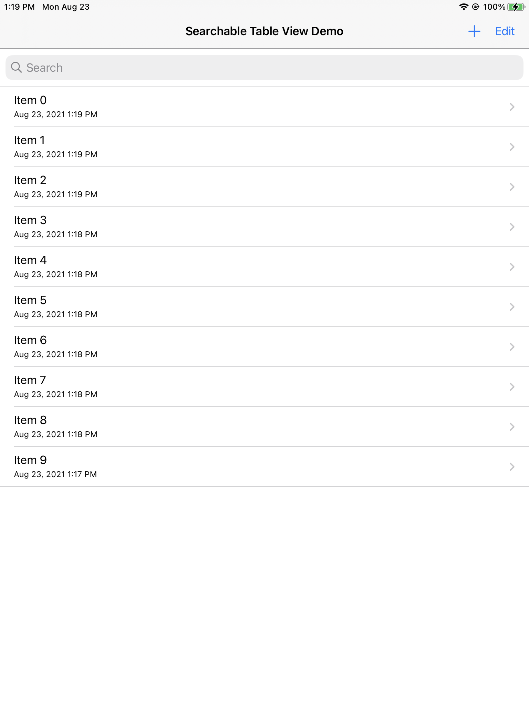

# SearchableTable

## Example

To run the example project, clone the repo, and run `pod install` from the Example directory first.



## Features

- Search Bar
- Edit Button
- Add Button
- Deleting
- Renaming
- Sorting by date
- Date Formatting

## Requirements

- iOS 13.0
- [AlertFactory](https://github.com/twh2898/AlertFactory)

## Installation

Add the following line to your Podfile:

```ruby
pod 'SearchableTable', :git => 'https://github.com/twh2898/SearchableTable'
```

## Author

Thomas Harrison, twh2898@vt.edu

## License

SearchableTable is available under the MIT license. See the LICENSE file for more info.
